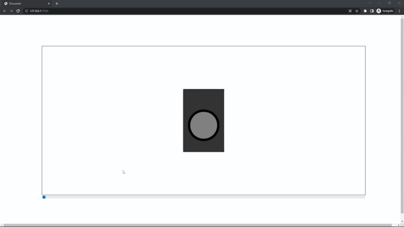

# Zdog.js pruebas 

## Inpiracion del proyecto & objetivo

-  El objetivo del proyecto es aprender a usar Zdog.js para crear una aplicación web. y aprender a crear diseños visuales.

El diseño web se ha creado en [Figma](https://www.figma.com/file/kP0SJhf4iDDa9kAzsz1LM1/Github-projects?node-id=0%3A1) por Carlos cruz valencia

## Tecnologias usadas

- Ide
    <!-- visual studio code -->
    <code></code>

- Programas usados
- lenguajes/frameworks usados
  
    <code></code><!-- css -->
    <code></code><!-- javascript -->
    <code></img></code>
    <code>Zdog.js</code>

## Vista previa del proyecto

</img>

## Estado del proyecto

|Trabajando en el proyecto|❌|
| -------------------------- | :----------------: |
|            Web responsive  |      ❌        |
|           Hosting          |   Githubpages |
| Websever app online        |         ❌    |  
| Dispone de trello          |         ❌    |  


## Licencia

Este proyecto está bajo la Licencia (MIT) - mira el archivo [LICENSE.md](LICENSE.md)  para mas detalles

<!-- ## !codigo temporal¡
## git update code
```shell
git add -A && git commit -a -m \"update\" && git push
```

## sass compiler code
```shell
sass -w --style compressed assets/styles/sass/main.scss assets/styles/css/main.css
``` -->

<!-- emojis  -->
<!-- https://tutorialmarkdown.com/emojis -->
